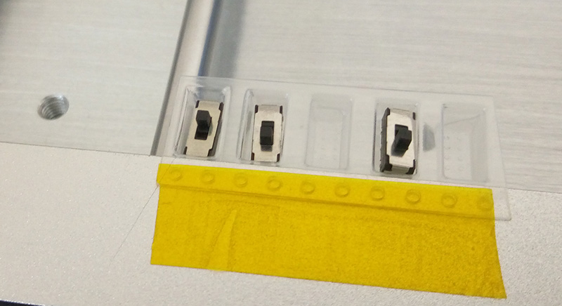

# THIS REPO IS BEING MERGED/REMOVED

There is a more complete repo at [github.com/sparkfunX/Desktop-PickAndPlace-CHMT36VA](https://github.com/sparkfunX/Desktop-PickAndPlace-CHMT36VA). The content from this repo has been merged in there, and this repo will not be updated.

# Charmin-High CHMT36VA Notes/Documentation

This repository serves as a resource for various information about the Charmin-High CHMT36VA. Most of this is applicable to other devices (CHMT48VA/B) but I'm concentrating on the CHMT36VA. There wasn't a lot of details on the CHMT36VA out there yet, so I was going in a little blind.

## Why CHMT36VA ##

There is a variety of low-cost pick-n-place machines out there. I choose the Charmin High CHMT36VA for a few reasons:

* Up and Down camera (critical for 0.5mm TQFP placement).
* Uses external computer, so will be easier to modify database files directly.
* Software was sent to me ahead of time to view/test (other manufactures won't do this it seems).
* Supported a range of tape sizes.
* Supported IC trays.

I wanted this device specifically to make target boards for my UFO Board. This is a pretty idea circumstance for a low-cost pick n place.

## Vision Notes ##

The camera makes a bounding box around the object based on bright spots it seems (i.e., legs which reflect well). You must be careful you don't get light shining in the camera (for example, from a window).

## Part-Specific Notes ##

### IC Devices ###

The default height of 0.5mm (this is somehow related to how low the Z-axis goes when placing, so a higher number means the part is higher) didn't seem as reliable on TQFP placements. I changed this height to about 0.8mm (for TQPF64) and it worked very well, I'm still experimenting and will update this.

It seems the 0.5mm default height smashes the parts into the board - it's fine for 0603 with the somewhat flexible nozzle, as the parts still get placed. I think with the TQFP it flexes down a little and they sometimes shift.

### Deeper Cut Tapes ###

The tape & reel feeders on this thing do not work well with deeper parts. They work great with resistors/capacitors or anything with constant depth.

Something like a SMD switch is no-go though, it won't even feed through the metal holder. Instead I found you could tape a strip to the frame, and set it up as an "IC Tray" with a single row:

You could probably make a nice fancy holder for this too, but this worked well enough for me as a test.

### Maximum Part Height ###

The maximum part height by the specs is 5mm. This is pretty accurate - you could use my "cut tape hack" from above to pickup deeper parts, but they will possibly hit stuff as the head is moving around, and when it tries to place them down it screws up the head.

You can "probably" get it to work with deeper parts, but I recommend just avoiding them if possible.

### Cover-Tape Doesn't Peel Off ###

The cover-tape sometimes doesn't peel off. This causes the device to not pickup parts, and almost always requires you to have vision enabled so it can detect this.

If everything otherwise seems OK (i.e., not snagged on anything) you can use a small hex driver to tighten the screw on the cover-tape take-up reel, which seems to improve the grip as it may be too lose. Turn it a small amount (1/8-turn to maybe 1/4 a turn) at a time.

### Parts turn upright ###

Small parts may turn up-right. If you don't program parts size this won't be detected. Anyway this is often caused as the pick-up location is a tiny bit off, so double-check the pickup location.

### Loading Cut Tape ###

It's worth buying a box of cover tape extenders (the tape that comes on reels). Search "SMT cover extender" on aliexpress.
